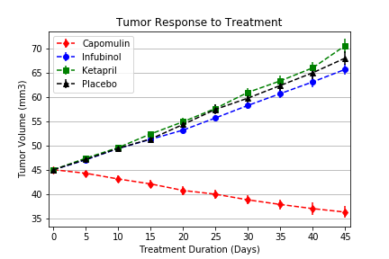
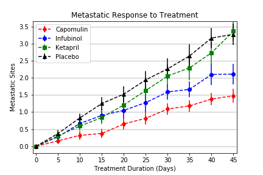
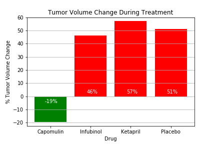

# Pymaceuticals

## **Objective:**
The objective of this project is to analyze data on mice treated with a variety of drug regimes to show how four treatments (Capomulin, Infubinol, Ketapril, and Placebo) compare in treating squamous cell carcinoma, a commonly occurring form of skin cancer. 

Using Matplotlib, the following graphs were created:
1. Scatter plot: Tumor volume vs. treatment duration (days)
2. Scatter plot: Number of metastatic (cancer spreading) sites vs. treatment duration (days)
3. Scatter plot: Survival rate (%) vs. treatment duration (days)
4. Bar graph: Total % tumor volume change vs. treatment

## **Tools:**
1. Python -  Matplotlib, Pandas, Numpy

## **Screenshots:**

