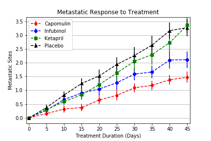
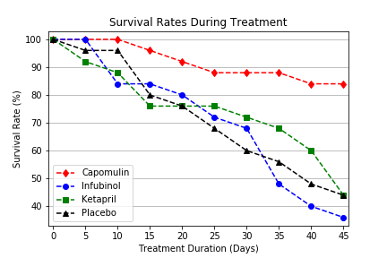
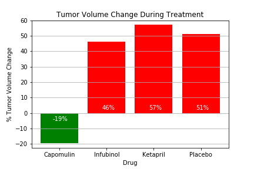

# Unit 5 – Matplotlib Homework, Pymaceuticals

## **Objective:**
The objective of this project is to analyze data on mice treated with a variety of drug regimes to show how four treatments (Capomulin, Infubinol, Ketapril, and Placebo) compare in treating squamous cell carcinoma, a commonly occurring form of skin cancer. 

Using Matplotlib, the following graphs were created:
1. Scatter plot: Tumor volume 
2. Scatter plot: Number of metastatic (cancer spreading) sites
3. Scatter plot: Number of mice alive changed during the 45 days of treatment for each drug regime
4. Bar graph: Total % tumor volume change during treatment for each drug regime.

## **Tools:**
1. Python -  Matplotlib, Pandas, Numpy

## **Screenshots:**

